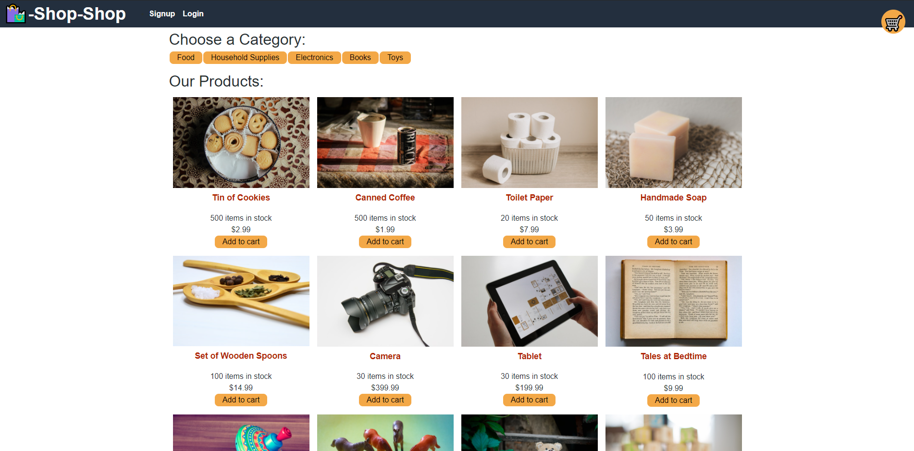

# shop-shop

## Description

A small example project using react, redux, graphql, and stripe. Pretend to shop at the shop... shop!
## Table of Contents
* [Installation](#Installation)
* [Usage](#Usage)
* [License](#License)
* [Contributing](#Contributing)
* [Tests](#Tests)
* [Questions](#Questions)
## Installation
No installation required! Start shop-shopping at the deployed site [here!](https://shop-shopp3.herokuapp.com/)
## Usage
Add items to the shop-shop cart. Remove unwanted items from the shop-shop cart. Click on items to see larger images and fake descriptions! Checkout using stripe (Please just don't use a real credit card, use 4242 4242 4242 4242. I am not responsible for what stripe does with your real credit card information). Free delivery on all non-existent items!
## License
This project is covered under the ISC license.
## Contributing
N/A
## Tests
N/A
## Questions
GitHub: [github.com/stephenbeiter](http://github.com/stephenbeiter)  
Email: [stephenbeiter@gmail.com](mailto:stephenbeiter@gmail.com)
## Created by
### Stephen Beiter
